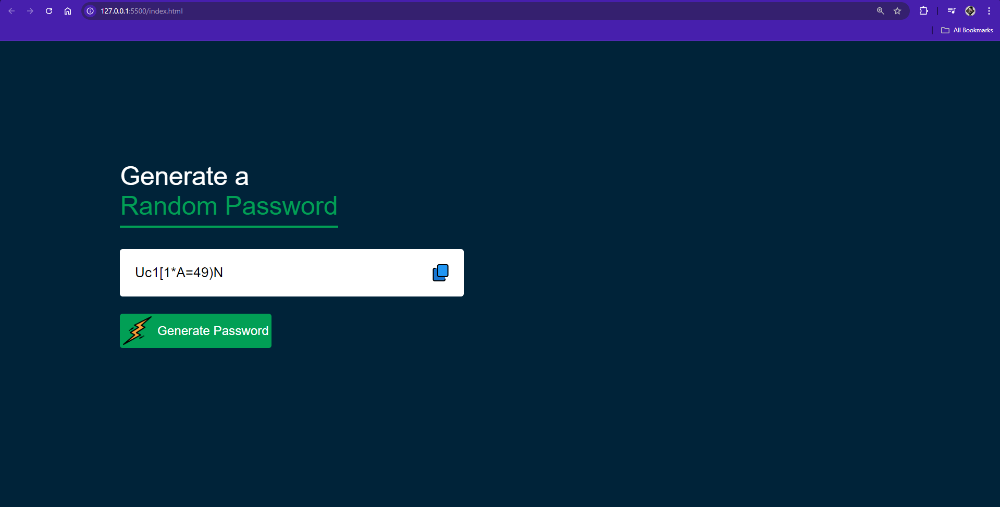

## Random Password Generator
### Overview
    The Random Password Generator is a simple web application that generates secure and random passwords. It includes features to copy the generated password to the clipboard with a visual feedback mechanism. This application aims to provide users with strong, unique passwords to enhance security for online accounts.

## Features
- Generates a random password including uppercase letters, lowercase letters, numbers, and symbols.
- Allows users to copy the generated password to the clipboard.
- Provides visual feedback when the password is successfully copied.

## Technologies Used
- HTML
- CSS
- JavaScript

## Usage
**Generate a Password:**
- Click the "Generate Password" button to generate a new random password.
- The password will be displayed in the input field.

**Copy the Password:**
- Click the copy icon next to the input field to copy the password to your clipboard.
- The icon will change temporarily to indicate the password has been copied.

## App Snapshots:
Here’s a brief overview of the main functionality:

### Home Page

### Generated Password

### Copy to Clipboard Confirmation

